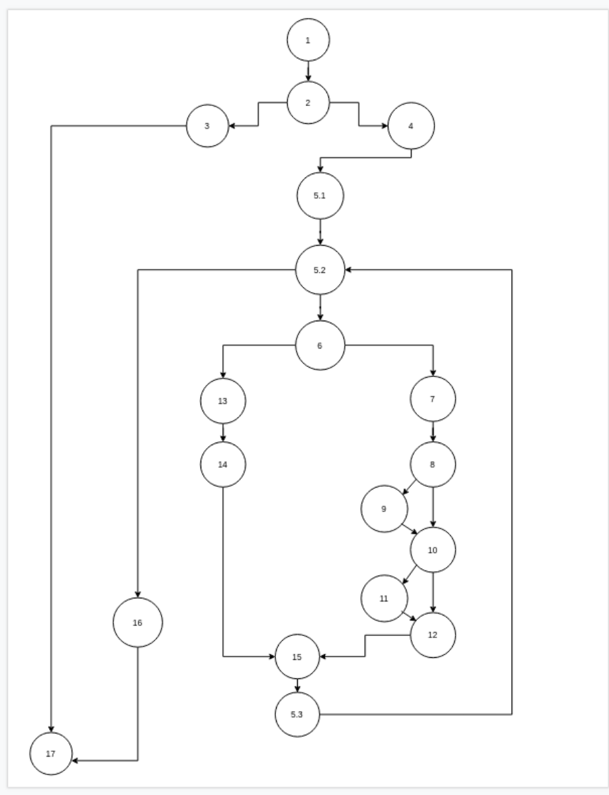
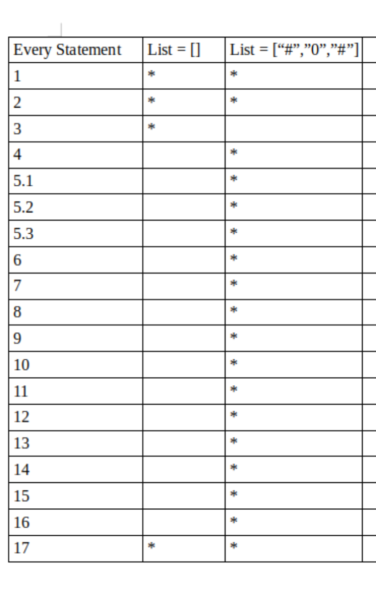
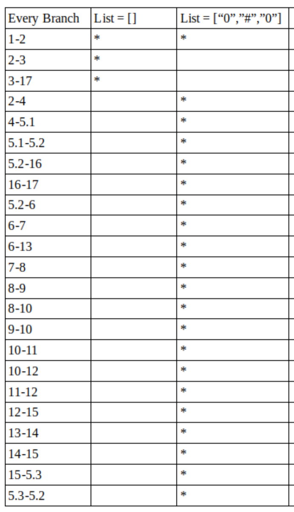

# Втора лабораториска вежба по Софтверско инженерство

## Доне Стоилков, бр. на индекс 186048

### Група на код: 

Ја добив групата на код 5

###  Control Flow Graph

Фотографија од control flow graph-ot:
 

### Цикломатска комплексност

Цикломатската комплексност на мојот код е 6, а истата ја добив со примена на следната формула:
бр. на региони = бр. на ребра - бр. на јазли + 2, односно бр. на региони = 23-19+2=6.Тоа го потврдив и со формулата бр. на региони = P + 1,каде што P е бројот на предкикатни јазли(јазли што се разгрануваат),односно бр. на региони = 5+1 = 6. А истото може да се увиде и преку мануелно броење на регионите при цртање на Control Flow Graph.

### Тест случаи според критериумот  Every statement 

### Тест случаи според критериумот Every branch

### Објаснување на напишаните unit tests

Every statement метода:

Every statement методата налага тестирање на секоја наредба во кодот, односно тестирање на секој ред код во нашата програма.Со моите 2 тест случаеви може да се истестира, односно ќе се посети секој ред, секоја наредба од кодот. Со првиот тест случај каде што даваме празна низа ние одиме во делот каде што програмата фрла исклучок, а со вториот тест случај каде што ја даваме низата ["#","0","#"] ние влегуваме во сите if-ови и го поминуваме и делот else.Така што за првиот член на низата(бомба) ние го скокаме првиот if и преминуваме на делот else, а со тоа што ја ставаме 0 на средна позиција се осигуруваме дека програмата ќе влезе и во двата if-ови кој што бројат од која страна колку бомби има.

Every branch метода:

Со every branch методата се тестира секоја гранка на кодот, односно таму каде што има инструкции за контрола на тек треба да се посетат и 2-те или повеќето дадени можности.Со првиот тест случај кој што ми е даден на мене повторно одиме во гранката која што од прво проверува дали низата е празна и ако е празна фрла исклучок односно ја гаси програмата.
А со вториот тест случај со поставување на нулите на 1-вата и 3-тата позиција се осигуруваме дека ќе се посетат и гранките каде што програмата проверува дали има бомба од страната и кога ќе се проверува за првиот елемент(првата 0) програмата ќе влезе само во вториот if кој што проверува дали има бомба од десно,додека за третиот елемент(втората 0) програмата ќе влезе само во првиот if кој што проверува дали има бомба од лево.И со вториот елемент(#) програмата ќе го скокне целосно if-от и ќе влезе во else.
